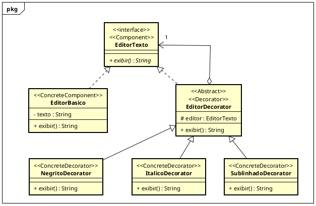

# Etapa 1 — Diagrama UML

O diagrama com os papéis do padrão Decorator:

- `EditorTexto`: Component
- `EditorBasico`: ConcreteComponent
- `EditorDecorator`: Decorator
- `NegritoDecorator`, `ItalicoDecorator` e `SublinhadoDecorator`: ConcreteDecorator

Objetivo foi separar o editor básico das formatações, cada formatação sendo uma classe que embrulha o editor, pra não ter que criar uma classe pra cada combinação.

O encadeamento vem da agregação do `EditorDecorator` com o `EditorTexto`. Ele é um `EditorTexto` e guarda um `EditorTexto`, que pode ser outro decorador.

## Próxima etapa

A primeira implementação e revisão crítica estão em
[v2-p1 — implementação e revisão crítica](https://github.com/Thalisson-Souza/APSOO-decorator/tree/v2-p1).
